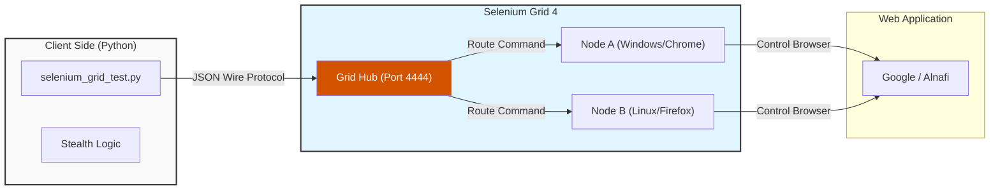

# Alnafi Selenium & Grid Framework: Enterprise Automation

**Author:** Saleem Ali
**Domain:** SDET, Distributed Testing, & Bot Automation
**Tech Stack:** Python, Selenium Grid 4, BeautifulSoup, Java

---

## ==>> Project Overview

This repository houses a production-grade **Distributed Automation Framework**. It goes beyond standard local testing by implementing **Selenium Grid 4**, allowing tests to be executed remotely across a network of nodes.

The framework includes **Stealth Algorithms** to mimic human behavior (bypassing bot detection on platforms like Gmail) and a **Grid Infrastructure** capable of parallel execution, simulating a real-world CI/CD testing environment.

---

## ==>> System Architecture

The system utilizes a Hub-and-Node architecture to decouple the test script from the execution environment.



---

## ==>> Key Technical Features

### => 1. Distributed Execution (Selenium Grid)

* **Hub Configuration:** Centralized server management using `selenium-server-4.38.0.jar`.
* **Node Management:** Dynamic registration of nodes with auto-driver detection.
* **Remote WebDriver:** Implementation of `webdriver.Remote` to execute tests on decoupled environments.

### => 2. Stealth & Human Emulation

* **Bot Avoidance:** Custom algorithms (`human_type`) with randomized keystroke delays (0.05s - 0.2s).
* **Flag Removal:** Disabling `AutomationControlled` flags to bypass anti-bot security layers.

### => 3. Advanced UI Interaction

* **Complex Actions:** Utilization of `ActionChains` for context clicks, double clicks, drag-and-drop, and hover effects.
* **Synchronization:** Robust `WebDriverWait` implementation to handle AJAX and dynamic DOM elements.

---

## ==>> Installation & Setup

### => Prerequisites

* Python 3.8+
* Java Runtime Environment (JRE) 11+ (For Selenium Grid)
* Browser Drivers (Chromedriver/GeckoDriver)

### => Step 1: Install Dependencies

```bash
pip install -r requirements.txt

```

### => Step 2: Start the Infrastructure

1. **Launch the Hub:**
```bash
java -jar Selenium-Grid/selenium-server-4.38.0.jar hub

```


2. **Launch a Node:**
```bash
java -jar Selenium-Grid/selenium-server-4.38.0.jar node --detect-drivers true

```


### => Step 3: Run the Test

```bash
python Selenium-Grid/selenium_grid_test.py

```

---

## ==>> Project Structure

```text
├── Selenium-Grid/
│   ├── selenium-server-4.38.0.jar  # Grid Server (Java)
│   ├── selenium_grid_test.py       # Remote Execution Script
├── screenshot/                     # Evidence Capture
├── gmail_login-1.py                # Stealth Login Logic
├── complex-element(...).py         # Advanced Mouse Actions
├── web_driver_auto_update.py       # Driver Manager
├── requirements.txt                # Dependencies
└── README.md                       # Documentation

```

---

## ==>> Contact

**Saleem Ali**

* **Role:** QA Automation Engineer & SDET
* **Focus:** Distributed Testing Systems & Automation Architecture.

